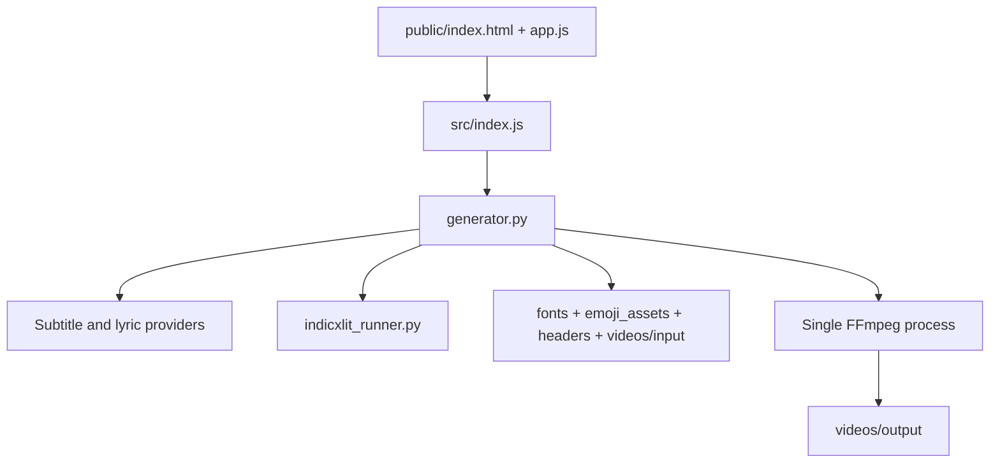

# System architecture

## Overview

The web studio is an Express application. It receives generation requests and streams progress to the browser with SSE. The Python engine owns lyrics retrieval, transliteration, subtitle generation, Pillow image composition, and FFmpeg rendering. Filesystem folders supply fonts, emoji artwork, headers, and background video clips.

## Module graph

## Constraints

- `.venv310\\Scripts\\python.exe` is required for the Python/IndicXlit environment.
- Existing templates are invariants; changes require explicit permission for that template.
- Rendering is one FFmpeg composition pass.
- `.env` is never edited or logged by agents.
- Missing usable lyrics must stop before FFmpeg, rather than produce a blank MP4.
