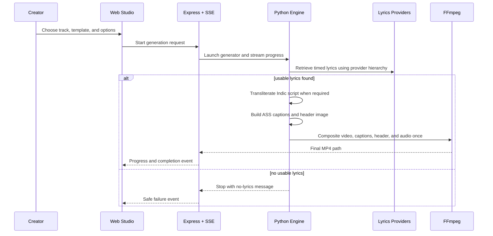

# Key flows

## End-to-end path of a typical request

## Other important flows

- Carousel generation is a separate Pillow renderer and must not alter existing video templates.
- Fast mode targets 540x960 at 24 FPS; final targets 1080x1920 at 30 FPS.
- YT Hindi Type has a separate visual contract: centered 1080x720 video on a 1080x1920 black canvas, EB Garamond lyrics, and Georgia Italic header with Apple-style emoji assets.
