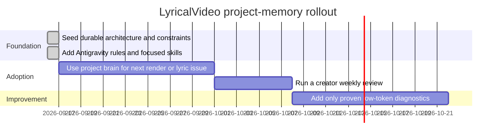

# Roadmap

## Milestones

## Milestone acceptance criteria

1. A new agent can identify the engine, template constraints, and no-lyrics guard by reading only relevant brain pages.
2. Antigravity can invoke focused workspace skills without scanning media or `.env` by default.
3. Each meaningful implementation session ends with either no brain change or one concise durable decision.
4. The creator vault contains active-song briefs and review notes, not copied source media or credentials.
