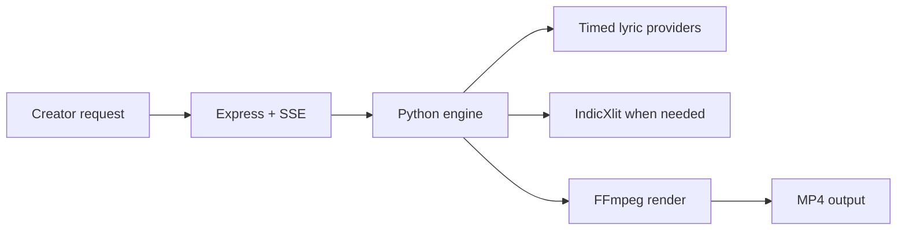

# Tech stack

## Technology choices

| domain | candidates | decision | rationale |
|---|---|---|---|
| Web server | Node frameworks | Express with ES modules | Existing lightweight API and SSE entrypoint. |
| Rendering engine | Browser, FFmpeg, external service | Python + Pillow + FFmpeg | Handles ASS subtitles, image composition, and local rendering. |
| Caption data | single provider | Ordered provider hierarchy | Maximizes chance of usable synced lyrics while preserving a safe stop condition. |
| Transliteration | manual conversion, model, IndicXlit | AI4Bharat IndicXlit subprocess | Required to avoid Indic script in YT Hindi Type output. |
| Persistent agent context | chat history only, database, Markdown | brain.md Markdown protocol | Portable, inspectable, cross-agent technical memory. |
| Antigravity customization | legacy workflows, workspace skills | `.agents` rules, skills, and custom agents | Current Antigravity workspace convention with on-demand loading. |

## Decision mindmap

## Open items

- Add automated deterministic preflight reports only when they reduce repeated manual work.
- Keep Antigravity permissions review-oriented for destructive or credential-adjacent operations.
